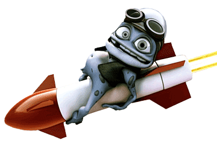
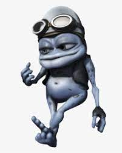
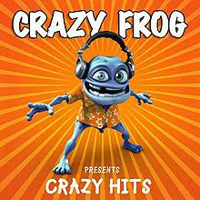
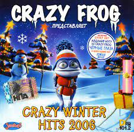
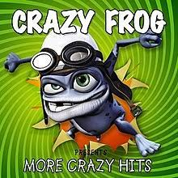
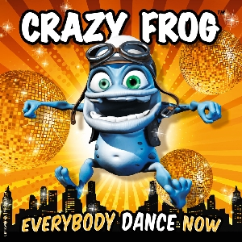

<style>
{
  color:white
}
</style>



# **Crazy Frog**

The biography of the frog and the minds behind him

---

# Intro

“Ring ding ding bem bem,” have you ever heard these words while crossing the street? Maybe you heard it in the car or on the school bus, or you found it on YouTube. Either way that’s not important, what is important is that you have heard the Crazy Frog. Starting in the late 90s and becoming popular in the 2000’s with his ringtone,  this frog has spanned decades with many original hits, cover songs, and games.

---
<style scoped>
{
  font-size: 1.3em
}
</style>
# Humble Beginnings (pt. 1)

It all started in 1997 when a 17-year-old kid named Daniel Malmedahl noticed that he could imitate a two-stroke engine sound. (Wilson, 2005) He and his friends found it very amusing and posted it online. In 2003, Erik Wernquist an animator at Kaktus Film in Sweden was emailed the humorous sound by a friend and inspired to base creation on it. In an interview with hitquarters.com, “I wanted to create a character that looked like he could sound like that sound…” He modeled and animated over 6 - 8 weeks creating the character we know now. The animation was paired with the aforementioned two-stroke engine sound. It was uploaded to cgitalk.com(a forum website focusing on 3d animation) forums under the name of the Annoying Thing. It instantly became highly popular on the forums and through peer-to-peer file-sharing programs. For a while that was it until 2004, someone at Jamba (a german ringtone company) contacted Erik Wernquist for the rights to use the Annoying Thing for ringtones in exchange for royalties(unknown amount). Quickly they also contacted Daniel Malmedahl — the 17-year-old kid who made the two-stroke engine sound from earlier — and also formed a deal with him.  (Blumentrath & Wernquist, 2005) Jamba rebranded the character as the Crazy Frog and sold the original two-stroke engine sound among a ringtone set with lots of marketing material to promote the entire ringtone set. Funnily, the marketing was so good it became obnoxious to viewers. According to Manchester News(2005), “[People] thought the [Crazy Frog] and his accompanying tune were on screen too often - or found it simply ‘annoying’.” 

---
<style scoped>
{
  font-size: 1.3em
}
</style>
# Humble Beginnings (pt. 2)

Eventually the Crazy Frog character became so popular it was practically the face of cellphone ringtones. Due to the newfound popularity of the Crazy Frog character, executives at Jamba decided to combine the most popular cell phone character with the most popular ringtone Axel F. In collaboration with Wolfgang Boss, Reinhard Raith and Henning Reith of the Bass Bumpers they created a remix of Axel F with the sounds of Daniel Malmedahl. They released the cover of Harold Faltermeyer’s Axel F on March 1, 2005. Instantly the song and music video accompanying it gained *add stats* Currently the Axel F video has *blabla views on youtube* Due to this enormous success the rightsholder*insert* decided to create a slew of songs,games, and all sorts of media featuring the character.

 <!-- Setting both lengths -->

---
<style scoped>
{
  font-size: 1.3em
}
</style>
# Albums

Over the years the Crazy Frog has released many albums.
Here is a brief list from Discogs.com

- Crazy Frog Presents Crazy Hits - 2005 
- Crazy Frog Presents Winter Hits- 2006 
- Crazy Frog Presents Winter Hits II- 2006 
- Crazy Frog Presents More Crazy Hits - 2006 
- Everybody Dance Now - 2009

---
<style scoped>

h1 {
  color: white;
  

}

</style>
# Albums





2005 2006 2006 2005 2009

---
# Quotes from Crazy Frog and the minds behind him

- ```Wh-wha-what's going on-on? Ding, ding This is the Crazy Frog Ding, ding``` - from Axel F song
- ```The Crazy Frog sound? That's my fault.``` - Daniel Malmehdal, 2005
- ```I just had fun doing it. I wanted to invent a funny thing. ``` - Erik Wernquist, 2005

---
# Tour
SUNDAY, DECEMBER 3rd - Perth 12:00 Booragoon's Garden City Shopping Center is sane.
3.00pm Mall at Morley

DECEMBER 5TH, MONDAY, 4.30 PM, Adelaide Sanity at Rundle Mall

TUESDAY, DECEMBER 6, 12 p.m. Sanity at Elizabeth Shopping Center
1.30pm Tea Tree Plaza at Westfields - Sanity
3.30pm Sanity at Westfields Marion Shoppingtown

Wednesday, December 7th, 12 p.m., HMV Bourke St. Mall, Melbourne

Dec. 8th, Thursday: Brisbane
2.30pm Queen St. Mall: Virgin, Music Store, HMV, and Sanity
6.00pm Hyperdome at Logan HMV, SANA, and JB Hi-Fi

Friday, December 9th, at noon, Sydney Cambletown's Macarther Square - Sanity/JB Hi-Fi

SUNDAY, DECEMBER 4TH, 11:00 A.M. Princess Margaret Hospital, Perth

MONDAY, DECEMBER 5TH, 2 PM Adelaide Women's and Children's Hospital

Wednesday, December 7, 3 p.m. Melbourne's Royal Children's Hospital
---
<style scoped>
{
  font-size: 1.3em
}
</style>
# Why I like Crazy Frog?

The sheer stupidity of the character is what intrigues me. Crazy Frog has his weenie doe out all the time and only makes noises. The concept and the history of the character makes me laugh. While researching for this project I found a page on Erik Wernquist's website featuring a extremely adult depiction of Crazy Frog. The reason I brought this up was because it's clear that Crazy Frog was originally meant to be a one-off adult gag joke by Erik Wernquist. But, instead Crazy Frog became a worldwide sensation targeting kids.

It's clear Crazy Frog is a product of incredible luck. What are the odds that someone of Erik's talent would get sent that audio and decide to create a professionalionally crafted model and animation for that. What are the odds one of the biggest ringtone companies would stumble across the silly animation test and offer a deal to the creators of it even if it is extremely risque. A company that was as big as Jamba would be extremely stupid to even consider putting a frog with a weenie doe on T.V but they did. Crazy Frog represents beating the odds to me. This is even better represented in his recent comeback. Nobody remembers Crazy Frog except me and probably two other people but he still came back for another round in spotlight. He hasn't achieved anywhere near his prior success but this is just the beginning. I believe in a couple years Crazy Frog will play at Rolling Loud among the greats with his weenie doe being the highlight of the night.