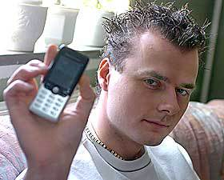
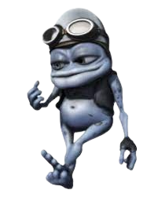
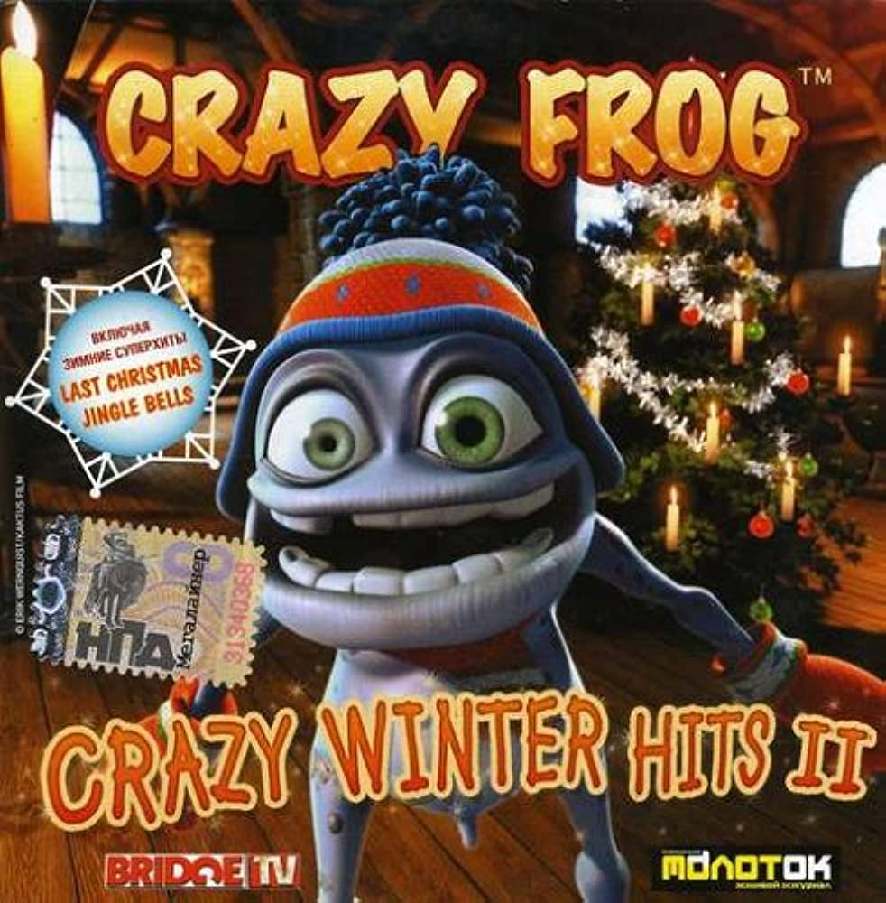

<style>
{
  color:white
}
</style>


# **Crazy Frog**

The biography of the frog and the minds behind him
Credits: Skye A and Jil P
Due Date: 3/31/23

---

# Intro

“Ring ding ding bem bem,” have you ever heard these words while crossing the street? Maybe you heard it in the car or on the school bus, or you found it on YouTube. Either way that’s not important, what is important is that you have heard the Crazy Frog. Starting in the late 90s and becoming popular in the 2000’s with his ringtone,  this frog has spanned many decades with many original hits, cover songs, and games. Let's hop into the main figures in Crazy Frog's creation and how he was spawned.

---
# Daniel Malmedahl
Daniel Malmedahl is the original voice actor of the Crazy Frog. He was born in 1980. In 1997, Daniel Malmedahl noticed that he could imitate a two-stroke engine sound. He and his friends found it very amusing and posted it online. His sound has  been spread throughout the internet through peer to peer file sharing,email, and word of mouth. The most popular use of his sound is of course Crazy Frog. (Wilson, 2005) According to last.fm, he is now 43 and works as computer component salesman in Gothenburg Sweden.  (last.fm, n.d.)


---
<style scoped>
{
  font-size: 1.3em
}
</style>
# Erik Wernquist
Erik Wernquist is the original artist of Crazy Frog.He was born in 1977 and is currently 45. He is a digital artist based in Sweden. Little are known about how he became an artist or when he got hired to work at Katkus Film(the original animation studio for Crazy Frog). In 2003, Erik Wernquist — while working at Katkus Film— was emailed the humorous sound by a friend and was inspired to base creation on it. In an interview with hitquarters.com, “I wanted to create a character that looked like he could sound like that sound…” He modeled and animated over 6 - 8 weeks creating the character we know now. The animation was paired with the aforementioned two-stroke engine sound. It was uploaded to cgitalk.com(a forum website focusing on 3d animation) forums under the name of the Annoying Thing(later renamed to Crazy Frog). It instantly became highly popular on the forums and through peer-to-peer file-sharing programs. Later it got used by Jamba(more on this company later) for ringtones and songs. Jamba rebranded the Annoying Thing to Crazy Frog and  Katkus Film developed the animations for the Crazy Frog music videos. (Blumentrath & Wernquist, 2005)After quitting his job at Katkus Film(the time he left is undocumented) he became a freelance artist and writer. Some of his most notable works shown on IMDb are writing on the Grotesco Show, creating the Wanderers animated short film, and animating on Metropia, and Crazy Frog. (IMDb, n.d.)Some of his freelance work shown on his website includes working on the logo and some concept art for a made-up superhero Lynx for the Berts Bagdok movie, working on a Volvo XC40 Recharge ad, and making the NASA/JPL Short Film: "Cassini's Grand Finale". (Erik Wernquist, n.d.)

---
# Reinhard Raith (SKIP IN PEER EDIT)
Reinhard Raith is one of the key producers on the Crazy Frog Albums. He has worked on some of Crazy Frog's most notable projects: Axel F, Crazy Frog in the House. (UltraTop, 2007 & 2005)  He is a part of the Bassbumpers music group in Ibiza, shareholder of Ministry Sound of Germany, and was a head of A&R record label. In his time as a producer in the Bassbumpers under pseudonym of DJ Voodoo he made many hits such as *insert hits* He started producing music  *finish this dude is unknown*

---
# Wolfgang Boss(SKIP NOT FINISHED)

---
<style scoped>
{
  font-size: 1.3em
}
</style>
# Jamba & Crazy Frog's Success (pt. 1)

Jamba(known as Jamster in Europe) was founded in Berlin by the Samwer Brothers in 2000. (Crunchbase, n.d.)  They mainly focused on providing ringtones. But, they also provided Java games, shopping services, MMS greeting cards, and other products for mobile phones. (Jamster, 2005) In 2004 they were sold to Verisign for 273 million dollars. In the same year, they got permission for the use of Crazy Frog and used him for ringtones and other media. Jamba is not responsible for any of the art and they outsource the music. For a while, the Crazy Frog(known as the Annoying Thing at the time) was just a small little meme, until someone at Jamba during 2004 (a german ringtone company) contacted Erik Wernquist for permission to use the Annoying Thing in exchange for an unknown amount of royalties of the record sales. Quickly they also contacted Daniel Malmedahl — the 17-year-old kid who made the two-stroke engine sound from earlier — and got permission to sell the sound for an unknown amount of royalties for ringtones sold and sales of records using the sound.  (Blumentrath & Wernquist, 2005) Jamba rebranded the character as the Crazy Frog and sold the original two-stroke engine sound among a ringtone set with lots of marketing material to promote the entire ringtone set. Funnily, the marketing was so good it became obnoxious to viewers. According to Manchester News(2005), “[People] thought the [Crazy Frog] and his accompanying tune were on screen too often - or found it simply ‘annoying’.”


---
<style scoped>
{
  font-size: 1.3em
}
</style>
# Jamba & Crazy Frog's Success (pt. 2)

Eventually the Crazy Frog character became so popular it was practically the face of cellphone ringtones. Due to the newfound popularity of the Crazy Frog character, executives at Jamba decided to create a cover of Axel F by Harold Faltermeyer with Crazy Frog. In collaboration with Wolfgang Boss, Reinhard Raith and Henning Reith of the Bass Bumpers they created a remix of Axel F with the Crazy Frog sounds of Daniel Malmedahl. They released the cover of Harold Faltermeyer’s Axel F on March 1, 2005. Instantly the song and music video accompanying it gained *add stats* Currently the Axel F video has *blabla views on youtube* Due to this enormous success Jamba decided to create a slew of songs, games, and all sorts of media featuring the character.

 <!-- Setting both lengths -->

---

<style scoped>

h1 {
  color: white;
  

}

</style>
# Albums





2005 2006 2006 2005 2009

---
# Quotes from Crazy Frog and the minds behind him

- ```Wh-wha-what's going on-on? Ding, ding This is the Crazy Frog Ding, ding``` - Crazy Frog,2005 (from Axel F song)
- ```The Crazy Frog sound? That's my fault.``` - Daniel Malmehdal, 2005(from BBC)
- ```I just had fun doing it. I wanted to invent a funny thing. ``` - Erik Wernquist, 2005(from Hitquarters Interview)
- ```One Year hard work !!! ``` - Reinhard Raith, 2022(from Facebook)

---
<style scoped>
{
  font-size: 0.9em
}
</style>
### 2005 Australia Tour(The below tour dates are the only online information of this tour,Source:Cashmere, 2005)
Average Ticket Cost: Free as this was the only tour and it was purely promotional
Saturday December 3 in Perth
12.00 p.m at Garden City Shopping Centre Booragoon, Sanity
3.00 p.m at Morley Galleria

Monday December 5 in Adelaide
4.30 p.m at Rundle Mall, Sanity

Tuesday December 6
12.00 p.m at Elizabeth Shopping Centre, Sanity
1.30 p.m at Westfields Tea Tree Plaza, Sanity
3.30 p.m at Westfields Marion Shoppingtown, Sanity

Wednesday December 7 in Melbourne
12.00 p.m at HMV Bourke St Mall

Thursday December 8 in Brisbane
2.30 p.m at Queen St Mall in Virgin/Music Shop/HMV/Sanity
6.00 p.m at Logan Hyperdome HMV/Sanity/JB Hi Fi

Friday December 9 in Sydney
12.30 p.m at Macarther Square Cambletown, Sanity/JB Hi Fi

Hospital Visits
Sunday December 4 in Perth
11.00 a.m at Princess Margaret Hospital 

Monday December 5 in Adelaide
2.00 p.m at Women's and Children's Hospital 

Wednesday December 7 in Melbourne
3.00 p.m at Royal Children's Hospital

---
<style scoped>
{
  font-size: 1.3em
}
</style>
# Why I like Crazy Frog?

The sheer stupidity of the character is what intrigues me. Crazy Frog has his weenie doe out all the time and only makes noises. The concept and the history of the character makes me laugh. While researching for this project I found a page on Erik Wernquist's website featuring a extremely adult depiction of Crazy Frog. The reason I brought this up was because it's clear that Crazy Frog was originally meant to be a one-off adult gag joke by Erik Wernquist. But, instead Crazy Frog became a worldwide sensation targeting kids.

It's clear Crazy Frog is a product of incredible luck. What are the odds that someone of Erik's talent would get sent that audio and Decemberide to create a professionalionally crafted model and animation for that. What are the odds one of the biggest ringtone companies would stumble across the silly animation test and offer a deal to the creators of it even if it is extremely risque. A company that was as big as Jamba would be extremely stupid to even consider putting a frog with a weenie doe on T.V but they did. Crazy Frog represents beating the odds to me. This is even better represented in his recent comeback. Nobody remembers Crazy Frog except me and probably two other people but he still came back for another round in spotlight. He hasn't achieved anywhere near his prior success but this is just the beginning. I believe in a couple years Crazy Frog will play at Rolling Loud among the greats with his weenie doe being the highlight of the night.

---
<style scoped>
section
{
  padding-top:25%;
  text-shadow: 0px 5px 2.5px black;
  font-size: 1.3em
  
}
</style>
# Crazy Frog Live Performance at the Dome in Germany(info from: IMDB)

The Dome is a German music T.V show where they went to event halls and people paid tickets for it. In the 38th episode they collaborated with Crazy Frog and this is the result.

---
# Music Video
<iframe id='ivplayer' width='640' height='360' src='https://invidious.privacydev.net/embed/k85mRPqvMbE?t=5' style='border:none;'></iframe>

---
# TODO
add reinhard raith and wolfgang boss biography
add henning raith
and check if their is any more main musicians and ppl to make biographies on
finish album and add all the dates
reread and shit
add pictures to biography and jamba--done
add average ticket cost-- done
add that daniel doesnt voice crazy frog anymore(i believe he only did the two-stroke)

---
# Rubric:
Presentation should include:
    1.  Biographies of all band members/musician….8-10 sentences per member and 2 citations each.  Solo musician needs ¾ page and 3 cites.
    2. Pictures of all members plus pics of performances, etc
    3. List of albums/cd/ with dates, sales totals, etc
    4. Quotes from each band member…for solo musician, 3 quotes.
    5. An itinerary of at least one tour for the band/musician
    6. A music video to be played in class of a song:  PG rated or less
    7. Why you like this band/musician-2 paragraphs
    8. Average cost of tickets to concerts…1 cite.

